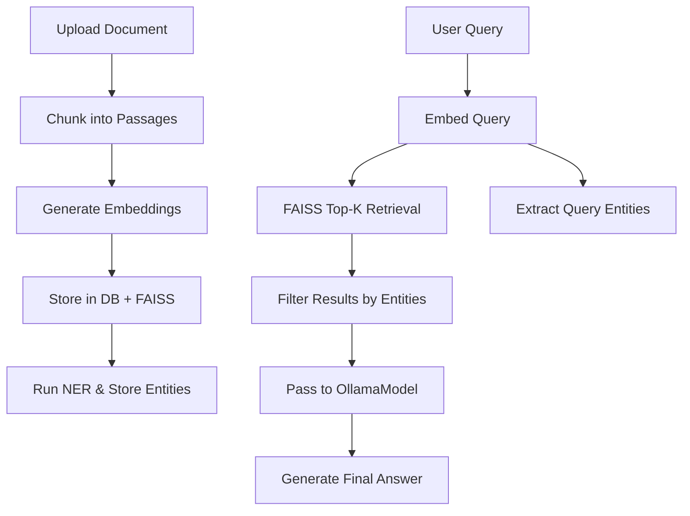

## 🧠 Graph-RAG: Lightweight Retrieval-Augmented Generation System

**Graph-RAG** is a modular, production-ready backend system built using **FastAPI**, designed for **document ingestion**, **semantic chunk retrieval**, and **contextual question answering** using both **FAISS-based vector search** and **entity-level filtering**.

---

### 🚧 Key System Components

#### 📦 1. Document Preprocessing & Storage Pipeline

The FastAPI backend exposes a multi-route workflow to:

* 📤 **Upload documents** via API
* ✂️ **Chunk documents** intelligently
* 🔡 **Generate embedding vectors** using HuggingFace models
* 🧠 **Run Named Entity Recognition (NER)** to extract entity labels
* 💾 **Store chunks, vectors, and entities** into a structured SQLite database

**Routes include:**

* `/upload`: Accepts PDF or text input
* `/chunk`: Splits docs into overlapping semantic chunks
* `/embed`: Converts chunks to vector embeddings
* `/ner`: Extracts named entities from each chunk
* `/live-query`: Executes real-time semantic + entity-level RAG

---

#### 🗃️ 2. SQLite + FAISS Hybrid Storage Layer

* Uses **SQLite** to persist all chunk data, embeddings, and named entities.
* **FAISS index** is dynamically built over the embedding vectors for fast approximate search.
* Chunk metadata (like entities) is used for **filtering results** at retrieval time.

Tables:

* `chunks`: Original and chunked text content
* `embed_vector`: Vector embeddings
* `entities`: Named entity labels for chunks

---

#### 🤖 3. Ollama Integration (LLM Inference)

* Implements **OllamaModel**, a wrapper for generating language responses using Ollama-hosted LLMs.
* Used at the final stage to **generate answers** conditioned on top-k retrieved chunks.
* Supports configurable model names (e.g., `mistral`, `llama3`, `phi3`, etc.).

---

#### 🧬 4. NERModel Module

* Custom `NERModel` wraps a HuggingFace transformer-based NER pipeline.
* Extracts named entities (e.g., PERSON, ORG, DATE) for each chunk.
* Enables **entity-level retrieval** by matching entity filters from user queries.

---

### ⚙️ Core Technologies

| Area            | Tooling                                            |
| --------------- | -------------------------------------------------- |
| API Server      | FastAPI                                            |
| DB              | SQLite (via `sqlite3`)                             |
| Semantic Search | FAISS                                              |
| Embedding Model | HuggingFace Transformers (`sentence-transformers`) |
| LLM             | Ollama (local or remote models)                    |
| NER             | HuggingFace NER pipeline (`bert`, `roberta`, etc.) |
| Logging         | Custom `setup_logging()` with multi-level support  |

---

### 🧪 Example Workflow

