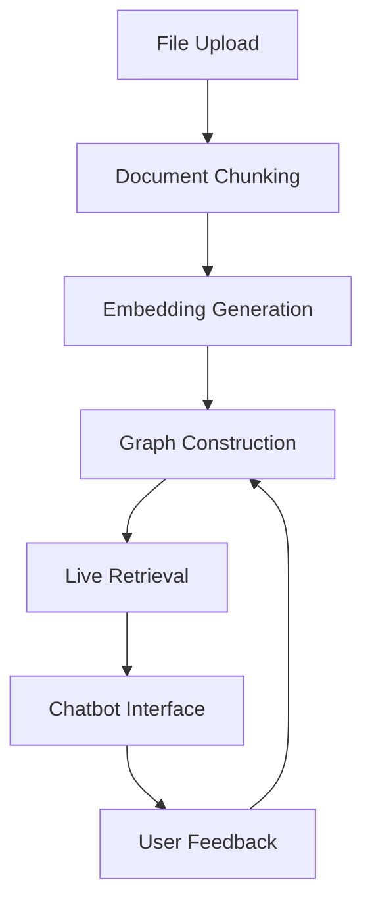

# Graph-RAG API 

A **Path-aware Retrieval-Augmented Generation** system using semantic graphs, built with FastAPI and MongoDB.


*(Diagram placeholder - replace with actual architecture image)*

## Features

- **Document Processing Pipeline**:
  - File upload with validation
  - Intelligent document chunking
  - Vector embedding generation
- **Path-aware RAG**:
  - Semantic graph construction
  - Contextual path retrieval
  - Dynamic relevance scoring
- **Multi-Model Support**:
  - Ollama LLM integration
  - HuggingFace embedding models
- **Monitoring**:
  - Resource usage tracking
  - Storage management

## System Workflow



## Tech Stack

| Component          | Technology               |
|--------------------|--------------------------|
| Backend Framework  | FastAPI (Python 3.13.5)  |
| Database           | MongoDB                  |
| Language Models    | Ollama, HuggingFace      |
| Embeddings         | HuggingFace Transformers |
| Monitoring         | Custom Resource Tracker  |

## Installation

1. **Prerequisites**:
   - Python 3.13.5
   - MongoDB (v7.0+)
   - Ollama server (for local LLMs)

2. **Setup**:
   ```bash
   git clone https://github.com/yourusername/graph-rag.git
   cd graph-rag
   python -m venv venv
   source venv/bin/activate  # Linux/Mac
   # OR
   venv\Scripts\activate    # Windows

   pip install -r requirements.txt
   ```

3. **Configuration**:
   Copy `.env.example` to `.env` and modify:
   ```env
   OLLAMA_MODEL=llama3
   EMBEDDING_MODEL=BAAI/bge-small-en-v1.5
   MONGO_URI=mongodb://localhost:27017
   ```

## API Endpoints

| Route | Method | Description |
|-------|--------|-------------|
| `/upload` | POST | File upload endpoint |
| `/chunk` | POST | Document chunking |
| `/embed` | POST | Generate embeddings |
| `/build-graph` | POST | Construct semantic graph |
| `/retrieve` | GET | Path-aware retrieval |
| `/chat` | POST | Chatbot interface |
| `/storage` | GET | Storage management |
| `/monitor` | GET | Resource metrics |

## Running the System 🏃

```bash
uvicorn main:app --reload
```

Access the API at `http://localhost:8000` and docs at `http://localhost:8000/docs`

## Development Structure 📂

```
graph-rag/
├── src/
│   ├── graph_db/          # MongoDB operations
│   ├── llms_providers/    # Model integrations
│   ├── rag/               # PathRAG core logic
│   ├── routes/            # API endpoints
│   └── helpers/           # Utilities
├── tests/                 # Test cases
├── main.py                # Application entrypoint
└── requirements.txt       # Dependencies
```
