# ChatBot with PathRAG


A smart chatbot powered by **Path-aware Retrieval-Augmented Generation (PathRAG)** that understands your documents and provides intelligent responses using semantic graph technology.

## 🚀 Quick Start

### Prerequisites
- Python 3.13+
- MongoDB 7.0+
- Ollama (for AI models)

### Installation

1. **Clone the repository**
```bash
git clone https://github.com/yourusername/ChatBot-with-PathRAG.git
cd ChatBot-with-PathRAG
```

2. **Install dependencies**
```bash
pip install -r requirements.txt
```

3. **Set up MongoDB**
```bash
# Using Docker (recommended)
docker run -d -p 27017:27017 --name mongodb mongo:7.0
```

4. **Install Ollama and models**
```bash
# Install Ollama
curl -fsSL https://ollama.com/install.sh | sh

# Pull AI model
ollama pull gemma2:2b
```

5. **Configure environment**
Create `.env` file:
```env
MONGO_LOCAL_URI="mongodb://localhost:27017"
OLLAMA_MODEL="gemma2:2b"
EMBEDDING_MODEL="all-MiniLM-L6-v2"
```

6. **Run the application**
```bash
python src/main.py
```

Visit: http://localhost:8000

## ✨ Features

- 📄 **Smart Document Processing** - Upload PDFs, TXT files and get intelligent responses
- 🧠 **PathRAG Technology** - Advanced retrieval using semantic graph relationships
- 💬 **Interactive Chat** - Natural conversation with your documents
- 📊 **Visual Graph Explorer** - See how your documents connect
- ⚡ **Fast & Efficient** - Optimized for speed with caching
- 🌐 **Web Interface** - Easy-to-use browser interface

## 🎯 How It Works

```mermaid
graph LR
    A[📄 Upload Documents] --> B[✂️ Split into Chunks]
    B --> C[🧮 Create Embeddings]
    C --> D[🕸️ Build Knowledge Graph]
    D --> E[💬 Ask Questions]
    E --> F[🤖 Get Smart Answers]
```



## 📋 Usage

### 1. Upload Your Documents
- Go to http://localhost:8000
- Click "Upload Documents"
- Select your PDF or TXT files
- Wait for processing to complete

### 2. Start Chatting
- Type your questions in the chat box
- Get intelligent answers based on your documents
- View the knowledge graph to see connections

### 3. Explore the Graph
- Click "Graph View" to see document relationships
- Interactive visualization of your knowledge base
- Click nodes to see content details

## 🏗️ Project Structure

```
ChatBot-with-PathRAG/
├── src/
│   ├── main.py              # Application entry point
│   ├── routes/              # API endpoints
│   ├── rag/                 # PathRAG core algorithm
│   ├── graph_db/           # MongoDB operations
│   ├── llms_providers/     # AI model integrations
│   └── web/                # Web interface
├── storage_graph/          # Graph data storage
├── logs/                   # Application logs
├── .env                    # Configuration
└── requirements.txt        # Dependencies
```

## 🔧 Configuration

### Basic Settings (`.env`)
```env
# Database
MONGO_LOCAL_URI="mongodb://localhost:27017"

# AI Models
OLLAMA_MODEL="gemma2:2b"
EMBEDDING_MODEL="all-MiniLM-L6-v2"

# Document Processing
CHUNKS_SIZE=500
CHUNKS_OVERLAP=30

# PathRAG Parameters
DECAY_RATE=0.85
PRUNE_THRESH=0.2
```

### Advanced Settings
- **DECAY_RATE**: How much to reduce path importance (0.8-0.9)
- **PRUNE_THRESH**: Minimum score to keep paths (0.1-0.3)
- **CHUNKS_SIZE**: Size of document chunks (300-800)
- **CHUNKS_OVERLAP**: Overlap between chunks (20-50)

## 🔍 API Endpoints

### Document Processing
```http
POST /api/v1/upload          # Upload documents
POST /api/v1/chunk           # Process documents
POST /api/v1/embed           # Create embeddings
POST /api/v1/build-rag       # Build knowledge graph
```

### Chat & Query
```http
POST /api/v1/chatbot         # Chat with your documents
```

**Example Request:**
```json
{
  "user_id": "user123",
  "query": "What is machine learning?",
  "cache": true
}
```

**Example Response:**
```json
{
  "llm_response": "Machine learning is a subset of AI...",
  "user_id": "user123",
  "cached": false
}
```

### Graph & Monitoring
```http
GET  /graph                  # View knowledge graph
GET  /api/v1/monitor        # System monitoring
GET  /api/v1/storage        # Storage management
```

## 🛠️ Troubleshooting

### Common Issues

**Ollama not working?**
```bash
ollama serve
ollama list
```

**MongoDB connection failed?**
```bash
docker ps  # Check if MongoDB is running
docker start mongodb
```

**Out of memory?**
- Reduce CHUNKS_SIZE in .env
- Increase PRUNE_THRESH to 0.3
- Process fewer documents at once

**Slow responses?**
- Check system resources at `/api/v1/monitor`
- Use smaller AI models (gemma2:2b instead of larger ones)
- Clear old data via `/api/v1/storage`

### Logs
```bash
# Check application logs
tail -f logs/pathrag.log

# Filter specific components
grep "CHATBOT" logs/pathrag.log
grep "ERROR" logs/pathrag.log
```

## 🎨 Customization

### Change AI Model
```bash
# Pull different model
ollama pull llama3:8b

# Update .env
OLLAMA_MODEL="llama3:8b"
```

### Adjust Response Quality
```env
# More context, slower responses
DECAY_RATE=0.9
PRUNE_THRESH=0.15

# Faster responses, less context
DECAY_RATE=0.8
PRUNE_THRESH=0.25
```

## 🤝 Contributing

1. Fork the repository
2. Create your feature branch: `git checkout -b feature/amazing-feature`
3. Commit your changes: `git commit -m 'Add amazing feature'`
4. Push to the branch: `git push origin feature/amazing-feature`
5. Open a Pull Request

## 📄 License

This project is licensed under the MIT License - see the [LICENSE](LICENSE) file for details.

## 🙏 Acknowledgments

- [Ollama](https://ollama.com/) - Local AI models
- [FastAPI](https://fastapi.tiangolo.com/) - Web framework
- [MongoDB](https://www.mongodb.com/) - Database
- [HuggingFace](https://huggingface.co/) - Embedding models
- [LangChain](https://langchain.com/) - Document processing

---

**Version**: 1.0.0  
**Last Updated**: July 28, 2025  
**Author**: [Your Name]

Made with ❤️ for intelligent document chat
