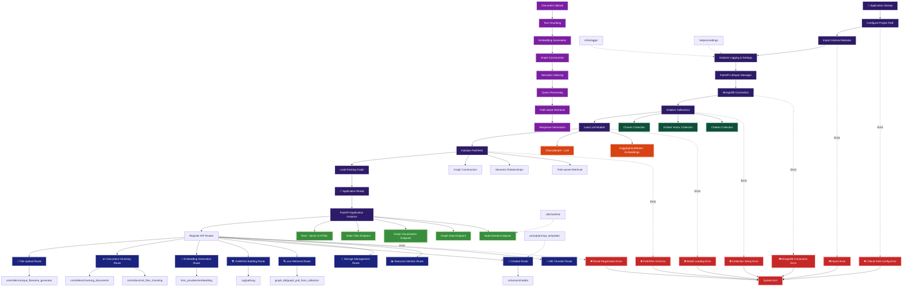

```mermaid
graph TD
    A[🚀 Application Startup] --> B[Configure Project Path]
    B --> C[Import Internal Modules]
    C --> D[Initialize Logging & Settings]
    D --> E[FastAPI Lifespan Manager]
    
    E --> F[MongoDB Connection]
    F --> G[Initialize Collections]
    G --> H[Load LLM Models]
    H --> I[Initialize PathRAG]
    I --> J[Load Existing Graph]
    J --> K[✅ Application Ready]
    
    %% Main Application Components
    K --> L[FastAPI Application Instance]
    L --> M[Register API Routes]
    
    %% Route Registration Flow
    M --> N1[📁 File Upload Route]
    M --> N2[✂️ Document Chunking Route]
    M --> N3[🧠 Embedding Generation Route]
    M --> N4[🏗️ PathRAG Building Route]
    M --> N5[🔍 Live Retrieval Route]
    M --> N6[💬 Chatbot Route]
    M --> N7[💾 Storage Management Route]
    M --> N8[📊 Resource Monitor Route]
    M --> N9[📝 MD Chunker Route]
    
    %% API Workflow
    N1 --> O1[controllers/unique_filename_generator]
    N2 --> O2[controllers/chunking_documents]
    N2 --> O3[controllers/md_files_chunking]
    N3 --> O4[llms_providers/embedding]
    N4 --> O5[rag/pathrag]
    N5 --> O6[graph_db/graph_pull_from_collection]
    N6 --> O7[schemas/chatbot]
    
    %% Database Operations
    G --> P1[Chunks Collection]
    G --> P2[Embed Vector Collection]
    G --> P3[Chatbot Collection]
    
    %% Model Loading
    H --> Q1[OllamaModel - LLM]
    H --> Q2[HuggingFaceModel - Embeddings]
    
    %% PathRAG Components
    I --> R1[Graph Construction]
    I --> R2[Semantic Relationships]
    I --> R3[Path-aware Retrieval]
    
    %% Web Interface
    L --> S1["Root - Serve UI HTML"]
    L --> S2["Static Files Endpoint"]
    L --> S3["Graph Visualization Endpoint"]
    L --> S4["Graph Data Endpoint"]
    L --> S5["Node Details Endpoint"]
    
    %% Error Handling
    B -.->|Error| T1[❌ Critical Path Config Error]
    C -.->|Error| T2[❌ Import Error]
    F -.->|Error| T3[❌ MongoDB Connection Error]
    G -.->|Error| T4[❌ Collection Setup Error]
    H -.->|Error| T5[❌ Model Loading Error]
    I -.->|Error| T6[❌ PathRAG Init Error]
    M -.->|Error| T7[❌ Route Registration Error]
    
    T1 --> U[System Exit]
    T2 --> U
    T3 --> U
    T4 --> U
    T5 --> U
    T6 --> U
    T7 --> U
    
    %% Supporting Modules
    V1[infra/logger] -.-> D
    V2[helpers/settings] -.-> D
    V3[utils/sanitize] -.-> S5
    V4[prompt/prompt_templates] -.-> N6
    
    %% Data Flow
    W1[Document Upload] --> W2[Text Chunking]
    W2 --> W3[Embedding Generation]
    W3 --> W4[Graph Construction]
    W4 --> W5[Semantic Indexing]
    W5 --> W6[Query Processing]
    W6 --> W7[Path-aware Retrieval]
    W7 --> W8[Response Generation]
    
    %% Styling
    classDef startup fill:#2d1b69,stroke:#ffffff,stroke-width:3px,color:#ffffff
    classDef routes fill:#1a237e,stroke:#e8eaf6,stroke-width:3px,color:#ffffff
    classDef database fill:#0d4f3c,stroke:#c8e6c9,stroke-width:3px,color:#ffffff
    classDef models fill:#d84315,stroke:#ffccbc,stroke-width:3px,color:#ffffff
    classDef errors fill:#c62828,stroke:#ffcdd2,stroke-width:3px,color:#ffffff
    classDef web fill:#388e3c,stroke:#dcedc8,stroke-width:3px,color:#ffffff
    classDef workflow fill:#7b1fa2,stroke:#f3e5f5,stroke-width:3px,color:#ffffff
    
    class A,B,C,D,E,F,G,H,I,J,K,L startup
    class N1,N2,N3,N4,N5,N6,N7,N8,N9 routes
    class P1,P2,P3 database
    class Q1,Q2 models
    class T1,T2,T3,T4,T5,T6,T7,U errors
    class S1,S2,S3,S4,S5 web
    class W1,W2,W3,W4,W5,W6,W7,W8 workflow
```